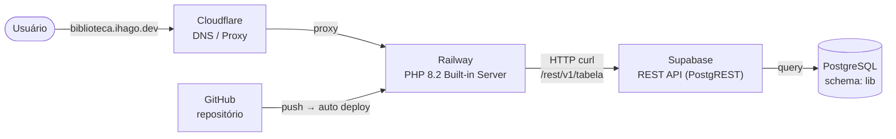

# Biblioteca App

**Acesse em: [biblioteca.ihago.dev](https://biblioteca.ihago.dev)**

Sistema de gerenciamento de biblioteca escolar em PHP puro, com banco de dados hospedado no Supabase (PostgreSQL) acessado via REST API.

## Arquitetura



## Funcionalidades

| Módulo | O que faz |
|---|---|
| **Alunos** | Cadastrar, editar e remover alunos |
| **Livros** | Cadastrar livros com editora e múltiplos autores, editar e remover |
| **Autores** | Manter catálogo de autores |
| **Editoras** | Manter catálogo de editoras |
| **Empréstimos** | Registrar empréstimos de múltiplos livros, controlar devolução com status (Em aberto / Atrasado / Devolvido) |

Todos os formulários possuem um botão **Aleatório** que gera e envia dados fictícios automaticamente.

## Stack

- **PHP 8.2** — sem frameworks, sem dependências externas
- **Supabase** — banco PostgreSQL hospedado, acessado via REST API (PostgREST)
- **cURL** — biblioteca padrão do PHP para as requisições HTTP
- **Tailwind CSS** — via CDN, sem build step

## Por que REST API em vez de conexão direta ao banco?

Ambientes de produção em cloud (Railway, Render, Cloudflare, etc.) bloqueiam conexões TCP diretas na porta 5432. O Supabase expõe os mesmos dados via HTTP na porta 443, que nunca é bloqueada. Todo acesso ao banco passa pela função `sbRequest()` em `app/config/supabase.php`.

## Estrutura do projeto

```
biblioteca_app/
├── Dockerfile                 # Imagem PHP 8.2-cli, porta 8080
├── index.php                  # Entrada única — roteamento por ?page=
│
├── app/
│   ├── config/
│   │   └── supabase.php       # Cliente HTTP — função sbRequest()
│   ├── assets/
│   │   └── style.css
│   └── helpers/
│       └── faker.php          # Gerador de dados aleatórios para testes
│
├── dal/
│   └── dal.php                # Data Access Layer — todas as queries via REST API
│
├── controller/
│   ├── alunoController.php
│   ├── livroController.php
│   ├── autorController.php
│   ├── editoraController.php
│   └── emprestimoController.php
│
└── view/
    ├── aluno.php
    ├── livro.php
    ├── autor.php
    ├── editora.php
    ├── emprestimo.php
    └── layout/
        ├── header.php
        └── footer.php
```

## Variáveis de ambiente

| Variável | Onde definir | Descrição |
|---|---|---|
| `SUPABASE_KEY` | Railway → Variables | `service_role` key do projeto Supabase |

## Schema do banco

As tabelas estão no schema `lib` do projeto Supabase. O schema é definido em `app/config/supabase.php`:

```php
define('SUPABASE_SCHEMA', 'lib');
```

Tabelas principais: `aluno`, `livro`, `autor`, `editora`, `livro_autor`, `emprestimo`, `emprestimo_livro`.

### Configuração obrigatória no Supabase

Por padrão o Supabase só expõe o schema `public` via REST API. É necessário:

**1. Expor o schema `lib`**

Supabase Dashboard → **Integrations → Data API → Settings → Exposed schemas** → adicionar `lib`.

**2. Conceder permissões às roles**

No **SQL Editor**, executar:

```sql
GRANT USAGE ON SCHEMA lib TO anon, authenticated, service_role;
GRANT ALL ON ALL TABLES IN SCHEMA lib TO anon, authenticated, service_role;
GRANT ALL ON ALL SEQUENCES IN SCHEMA lib TO anon, authenticated, service_role;
```
